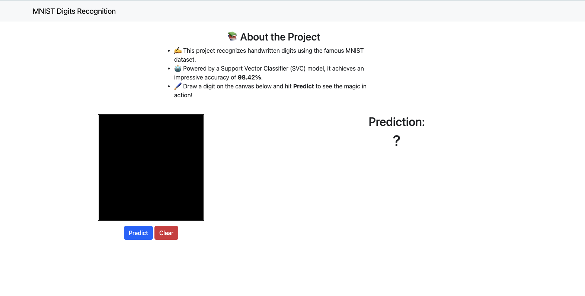
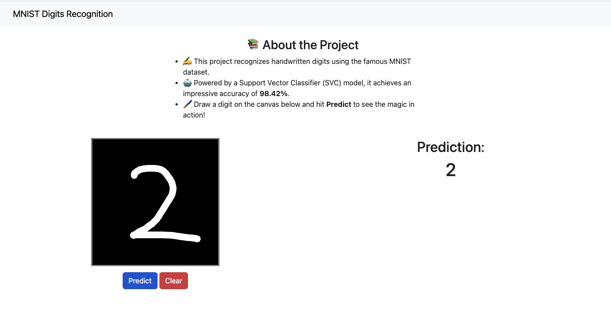

# MNIST Digits Recognition


## 🎯 Project Goal

Guided by examples and techniques from the book *Hands-On Machine Learning with Scikit-Learn, Keras, and TensorFlow*, this project explores essential steps in the ML pipeline—from data preprocessing and feature engineering to model training, evaluation, and deployment as an end-to-end application.

The goal of this project is to build an end-to-end application that recognizes handwritten digits using the MNIST dataset. The application will allow users to draw digits (or provide handwritten digit images) and predict the digit using a trained machine learning model. This involves:
1. **Model Training** : A machine learning model is trained to recognize digits (0-9) from the MNIST dataset.
2. **Interactive Web Application** :
	* Users can draw a handwritten digit using a canvas or upload an image.
	* The application predicts the digit based on the trained model.

## ✅ Solution Details

### 🧮 Performance Measure
To evaluate and compare models, the following metrics were used:
- **Weighted F1 Score**: To balance precision and recall.
- **Accuracy**: To measure the percentage of correct predictions.
- **Class-wise F1 Score**: To analyze performance for individual classes.
- **Confusion Matrix**: To identify specific misclassifications and analyze errors. 

### 🚧 Data Transformation
The MNIST dataset was preprocessed using **Normalization** to scale pixel intensity values between 0 and 1.

### 📂 Dataset
The MNIST dataset is directly accessible from `sklearn`:
```
from sklearn.datasets import fetch_openml
mnist = fetch_openml("mnist_784", as_frame=False)
```
* The `train` and `test` set used for training and validation, as well as augmented data set can be accessed from public `Google Drive` folder [here](https://drive.google.com/drive/folders/10FmschultsicypMnWv-uI957F35P2ro5).

### 📒  Notebooks
* [00_get_data.ipynb](https://github.com/gaurangdave/mnist_digits_recognition/blob/main/notebooks/00_get_data.ipynb) Download the dataset and save locally. <a href="https://colab.research.google.com/github/gaurangdave/mnist_digits_recognition/blob/main/notebooks/00_get_data.ipynb" target="_blank"></a>

* [01_explore_data.ipynb](https://github.com/gaurangdave/mnist_digits_recognition/blob/main/notebooks/01_explore_data.ipynb) Data exploration and splitting the train/test set.<a href="https://colab.research.google.com/github/gaurangdave/mnist_digits_recognition/blob/main/notebooks/01_explore_data.ipynb" target="_blank"></a>

* [02_training_evaluation_colab.ipynb](https://github.com/gaurangdave/mnist_digits_recognition/blob/main/notebooks/02_training_evaluation_colab.ipynb) Model training and evaluation on Google Colab. <a href="https://colab.research.google.com/github/gaurangdave/mnist_digits_recognition/blob/main/notebooks/02_transform_data.ipynb" target="_blank"></a>

* [03_training_evaluation_local.ipynb](https://github.com/gaurangdave/mnist_digits_recognition/blob/main/notebooks/03_training_evaluation_local.ipynb) Model training and evaluation on a local machine.

* [04_training_augmented_data.ipynb](https://github.com/gaurangdave/mnist_digits_recognition/blob/main/notebooks/04_training_augmented_data.ipynb) Training `SVC` on augmented data.

* [05_testing_prod_model.ipynb](https://github.com/gaurangdave/mnist_digits_recognition/blob/main/notebooks/05_testing_prod_model.ipynb) Sanity testing production models.

* [06_ensemble_learning.ipynb](https://github.com/gaurangdave/mnist_digits_recognition/blob/main/notebooks/06_ensemble_learning.ipynb) Experimenting with various ensemble learning techniques.

* [07_huggingface_integration.ipynb](https://github.com/gaurangdave/mnist_digits_recognition/blob/main/notebooks/07_huggingface_integration.ipynb) Hugging face integration.

* [08_model_performance_analysis.ipynb](https://github.com/gaurangdave/mnist_digits_recognition/blob/main/notebooks/08_model_performance_analysis.ipynb) Analysing various model performances.

### 🧠 Model Insights
Production Model:
* **Algorithm**: Support Vector Classifier (SVC)
* **Performance**:
  * Weighted F1 Score: **~0.99**
  * Accuracy: **~0.99**
  * Class-wise average F1 Score: **~0.99**
* **Hyperparameters**:
	* kernel: rbf
	* C: 10
	* gamma: scale
	* Trained using normalized data.

**Observations:**
* The model performs well overall but struggles with specific misclassifications:
* 53% of misclassified 6s are predicted as 0.
* 54% of misclassified 4s are predicted as 9.
* Digits like 3, 5, and 8 also have higher misclassification rates, likely due to their visual similarity.
 
### 📈 Latest Experiments:
* Augmented original training data with shifted versions of each digit to simulate new samples.
* Trained and compared various **ensemble learning techniques**:
  * **Voting Classifier**: Hard and Soft Voting
  * **Blending**: Using Logistic Regression, Gradient Boosting, Random Forest, and SVC as final estimators
* Performed **feature importance analysis** on blended models to identify contributing models
* Conducted **feature engineering** experiments with top-N model outputs as inputs to the blender to find a sweet spot between diversity and redundancy
* Final evaluation showed **SVC with augmented data consistently outperformed others**, with Gradient Boosting and Random Forest-based blenders as close seconds.

* All models including ensemble variations and production SVC can be found [here](https://huggingface.co/gaurangdave/mnist_digits_recognition)

## 💻 Tech Stack

  
  
  
  
  
  
  
  

### 🛠️ Tools and Platforms:
1. **Google Colab**: Used for data exploration, training, and evaluation of the digit recognition model.  
2. **Python**: Primary programming language for machine learning, data preprocessing, and API development.  
3. **Scikit-learn**: For data preprocessing and building classical ML models.  
4. **TensorFlow**: For building and training deep learning models (if needed for improved performance).  
5. **Plotly**: For creating interactive visualizations during the analysis phase.  
6. **FastAPI**: For exposing the trained model as an API and building backend services.  


## ⚙️ Setting Up Secrets in Google Colab

* To run this project on Google Colab securely, you will need to set up a secret to store the shared Google Drive folder path. 
* This ensures your intermediate data storage path is not exposed when sharing notebooks.

### Step-by-Step Instructions:

1. Open Google Colab:
* Open the notebook you want to run in Google Colab.
2. Access the Secrets Manager:
* In the Colab notebook, click on the lock icon 🔒 in the top-right corner of the interface (next to the table of contents icon).
* This will open the Secrets Manager.
3. Add a New Secret:
* Click “Add new secret”.
* Set the name of the secret as: SHARED_DRIVE_PATH.
* Set the value of the secret as the path to your shared Google Drive folder. For example:
```bash
/content/drive/My Drive/shared_folder_name
```
4. Access the Secret in Code:
* The secret is accessed in the notebook using the following code:

```bash
from google.colab import userdata

# Retrieve the Google Drive path stored in secrets
shared_folder_path = userdata.get("SHARED_DRIVE_PATH")

# Use the shared folder path in your code
print(f"Using shared folder: {shared_folder_path}")
```
5. Ensure Google Drive is Mounted:
* Mount Google Drive in your notebook before using the secret:

```bash
from google.colab import drive
drive.mount('/content/drive')
```

6. Verify the Path:
* Check if the folder exists:

```bash
import os
if os.path.exists(shared_folder_path):
    print("Shared folder is accessible!")
else:
    print("Shared folder path is incorrect. Please check your secret.")
```
Important Notes:

* Secrets are private and not shared with others, even if you share your Colab notebook.
* Each user must add their own `SHARED_DRIVE_PATH` secret to run the code successfully.
* If you’re collaborating with others, ensure everyone uses a consistent folder structure in their Google Drive.


## 💻 Running Locally

### Install Dependencies

- Create conda environment with `Python 3.12`

```bash
  conda create -n ml python=3.12
```

- Activate the environment

```bash
  conda activate ml
```

- Install ML Libraries

```bash
conda install numpy pandas scikit-learn matplotlib seaborn plotly jupyter ipykernel -y
```

```bash
conda install -c conda-forge python-kaleido
```

- Install GDown
```bash
conda install conda-forge::gdown
```

- Install HuggingFace
```bash
conda install conda-forge::huggingface_hub
```


- Install DotEnv
```bash
conda install conda-forge::python-dotenv
```

- Install FastAPI

```bash
conda install -c conda-forge fastapi uvicorn -y
```

### Setup HuggingFace
* Create a `.env` file in the root directory and save the `HuggingFace` API Key as `HF_TOKEN`
```bash
HF_TOKEN="your_hugging_face_token"
```

### Training Model for API

* Run the following command to train model(s) for production use

```bash
python -m scripts.training
```

### Running the API
* Run the following command to start the API server

```bash
uvicorn api.main:app --reload
```

* Go to the following URL to access API Docs
```URL
http://localhost:8000/docs
```

### Running API Test Cases
* Run the following command to run all the test cases
```bash
pytest
```

* Run the following command to run a specific test case
  * Here `test_predict_digit_endpoint` is the name of test case in `tests/test_api.py` file.
```bash
pytest -k test_predict_digit_endpoint
```

### API Reference

| Action                                           | HTTP Method | Endpoint                                 |
|--------------------------------------------------|-------------|------------------------------------------|
| Get predictions using                            | **`POST`**  | `/predict`                               |

### Accessing UI

* To access the UI application, simply go to `http://localhost:8000` after starting the server and you should be able to access the webapp. 

### App Screenshots

#### Default Home Page


#### Prediction


## 📈 Visualizations

### Metric Comparison Of Various Models


### Class-wise F1 Score Heatmap


### Class-wise F1 Score Distribution


### Confusion Matrix for Production Model against test data


### Confusion Matrix specifying errors of Production Model against test data


## 📊 Project Insights
* The final model achieved a `Weighted F1 Score` of `0.98` and `Accuracy` of `0.98` 
* We were also able to acheive an average classbased `F1` score of `0.98`, which means our model has a balanced `Precision` and `Recall`, which means we have high `True Positive` rates and low `False Negative` rates. 
* Our model still makes errors in some classification, 
  * e.g. `53%` of misclassified 6 is classified as 0 and `54%` of misclassified 4s are classified as 9s. 
  * Similarly there is higher rate of misclassification between 3, 5 and 8 and hypothesis is this could be because of similarity of these digits in hand written format. 

### 👣 Next Steps
- [X] Train the model with augmented data to improve performance.
- [ ] Explore digit-specific augmentation or oversampling for digits with lower F1 scores.
- [ ] Investigate model-specific confusion matrices to understand digit confusion patterns.
- [ ] Try deep learning approaches (CNNs) to push performance further.

## 🧪 Model Selection Rationale
* While many models performed well, **SVC with augmented data** offers the best trade-off between performance and simplicity.
* Blending with top models also gives excellent performance and can be retained for future experimentation or production.

## 🏫 Lessons Learnt
1.	**Machine Learning Concepts:**
    * Gained a deeper understanding of classification algorithms (e.g., Logistic Regression, SVC, Random Forest, KNN), their **hyperparameters**, and their impact on model performance.
    * Explored **classification metrics** like F1 Score, ROC-AUC, and confusion matrices, and learned how to interpret them for effective model evaluation.
2.	**Data Exploration & Engineering:**
    * Learned techniques to analyze image datasets, including pixel intensity distributions and feature variability
    * Debugged issues related to preprocessing pipelines in production and gained insight into handling **fit vs transform pitfalls**.
3.	**End-to-End Workflow:**
    * Integrated the model into a **production-ready API** using FastAPI and created a front-end interface for real-time interaction with the model.
    * Realized the importance of **E2E testing**, as it uncovered potential bugs that wouldn’t have been apparent during model evaluation on test data.
    
## 🌟 Project Highlights
1. End-to-End Application:
* Includes a model training pipeline, API, and a front-end interface.
2. User Interaction:
* Users can draw digits on a canvas and get predictions in real time.

## 🚀 About Me

A jack of all trades in software engineering, with 15 years of crafting full-stack solutions, scalable architectures, and pixel-perfect designs. Now expanding my horizons into AI/ML, blending experience with curiosity to build the future of tech—one model at a time.

## 🔗 Links

[](https://gaurangdave.me/)
[](https://www.linkedin.com/in/gaurangvdave/)

## 🛠 Skills

`Python`, `Jupyter Notebook`, `scikit-learn`, `FastAPI`, `Plotly`, `Conda`

